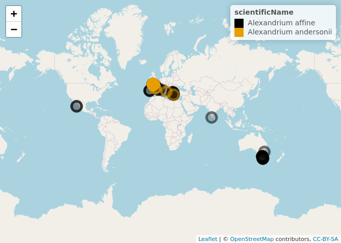

Harmful Agal Bloom species in OBIS
================

### Requirements

-   [R v4.1+]()
-   [rlang](https://CRAN.R-project.org/package=rlang)
-   [robis](https://CRAN.R-project.org/package=robis)
-   [readr](https://CRAN.R-project.org/package=readr)
-   [dplyr](https://CRAN.R-project.org/package=dplyr)
-   [sf](https://CRAN.R-project.org/package=sf)

### Installation

    remotes::install_github("BigelowLab/habobis")

### Data storage

This package downloads, stores and minipulates a subset of OBIS data
records for user specified species. In an effort to make this work in
your location of choice we provide you with the tools to define a data
path we call `root_path`, but you can always override the default.

The easiest way to set the path is to create a hidden text file in your
home directory, `~/.habobis`. The file needs only one line of
information: the path to the data set. For example, the author’s has
this `/mnt/ecocast/coredata/obis/hab`. This works well because it
persists across R sessions.

You can also set it per session using
`options(habobis_root = "/put/your/path/here")`.

### Read and fetching data - a blurred distinction.

You can explicity download a species.

``` r
suppressPackageStartupMessages({
  library(habobis)
  library(dplyr)
})
x <- fetch_species("Alexandrium affine")
glimpse(x)
```

    ## Rows: 157
    ## Columns: 8
    ## $ id               <chr> "01ba686b-6434-4622-833e-4cef1620edf2", "0240e086-dbe…
    ## $ scientificName   <chr> "Alexandrium affine", "Alexandrium affine", "Alexandr…
    ## $ eventDate        <date> 1994-11-17, NA, 2003-06-26, 2002-09-03, 2014-11-17, …
    ## $ decimalLongitude <dbl> -3.84003, 76.56028, 22.94583, 22.82016, -2.53827, -11…
    ## $ decimalLatitude  <dbl> 47.773320, 8.931944, 39.355000, 39.274181, 47.457600,…
    ## $ depth            <dbl> NA, NA, 1, 1, NA, NA, NA, NA, NA, NA, NA, NA, NA, NA,…
    ## $ sst              <dbl> NA, NA, NA, NA, NA, NA, NA, NA, NA, NA, NA, NA, NA, N…
    ## $ sss              <dbl> NA, NA, NA, NA, NA, NA, NA, NA, NA, NA, NA, NA, NA, N…

But you can also simply **read** by species. If you haven’t already
downloaded that species then it will be fetched for you.

``` r
y <- read_species("Alexandrium andersonii")
glimpse(y)
```

    ## Rows: 52
    ## Columns: 8
    ## $ id               <chr> "0f870985-6713-4f0c-a5ea-75caba11d2f1", "125530ca-0fa…
    ## $ scientificName   <chr> "Alexandrium andersonii", "Alexandrium andersonii", "…
    ## $ eventDate        <date> 2003-07-01, 2000-06-19, 2009-08-10, 2000-06-26, 2005…
    ## $ decimalLongitude <dbl> 23.67000, -3.97870, -4.29819, -3.98669, -4.34906, -4.…
    ## $ decimalLatitude  <dbl> 37.94000, 47.89832, 48.10991, 47.73332, 47.85260, 48.…
    ## $ depth            <lgl> NA, NA, NA, NA, NA, NA, NA, NA, NA, NA, NA, NA, NA, N…
    ## $ sst              <lgl> NA, NA, NA, NA, NA, NA, NA, NA, NA, NA, NA, NA, NA, N…
    ## $ sss              <lgl> NA, NA, NA, NA, NA, NA, NA, NA, NA, NA, NA, NA, NA, N…

### Reading multiple species

You can read more than one species at a time and bind them into one
table.

``` r
x <- read_species(c("Alexandrium affine", "Alexandrium andersonii"), bind = TRUE)
count(x, scientificName)
```

    ## # A tibble: 2 × 2
    ##   scientificName             n
    ##   <chr>                  <int>
    ## 1 Alexandrium affine       157
    ## 2 Alexandrium andersonii    52

### Read as spatial objects

``` r
library(sf)
```

    ## Linking to GEOS 3.7.2, GDAL 3.0.4, PROJ 6.3.2; sf_use_s2() is TRUE

``` r
library(leaflet)
x <- read_species(c("Alexandrium affine", "Alexandrium andersonii"), bind = TRUE, form = "sf") |>
  group_by(scientificName)

pal <- colorFactor(
  palette.colors(n = nrow(group_data(x))),
  group_data(x)$scientificName,
  na.color = "#808080"
)

leaflet(data = x) |>
  addTiles() |>
  addCircleMarkers(color = ~pal(scientificName)) |>
  addLegend(pal = pal, values = ~scientificName, opacity = 1)
```

<!-- -->
